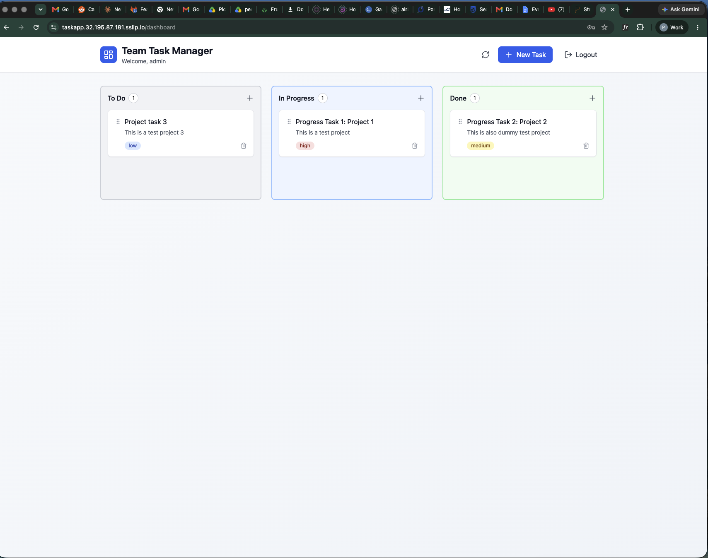

Capstone Project - TaskApp on Kubernetes

This repo contains everything needed to deploy the TaskApp on a self-managed
three-node Kubernetes cluster on AWS. It covers infrastructure provisioning,
cluster setup, application deployment, GitOps, and observability.

The app is a simple task manager with a React frontend, Flask backend, and
Postgres database. The goal is to take it from a single-server Portainer
setup to a production-style Kubernetes deployment with high availability,
autoscaling, zero-downtime deploys, and TLS.

What is in here:

  infra/terraform/   - creates the VPC, security groups, and EC2 instances
  infra/ansible/     - installs k3s on the nodes and hardens them
  manifests/         - Kubernetes manifests for the app and platform tools
  gitops/            - Argo CD Application definitions
  docs/              - architecture, runbook, cost breakdown, and evidence

How to use it:

  1. Run Terraform to provision the three nodes (see infra/terraform/README.md)
  2. Run Ansible to install k3s and join the workers (see infra/ansible/README.md)
  3. Apply the Argo CD Application manifests (see gitops/README.md)
  4. Argo CD takes it from there and keeps the cluster in sync with git

The live app is at https://taskapp.32.195.87.181.sslip.io
Grafana is at https://grafana.32.195.87.181.sslip.io
Argo CD is at https://argocd.32.195.87.181.sslip.io

Live App Screenshot:

